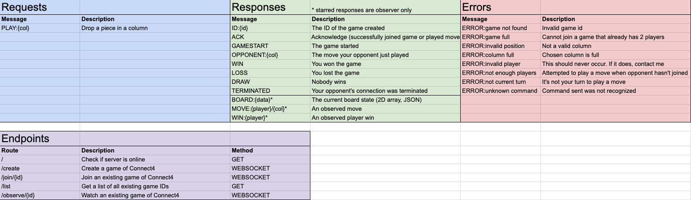

# Minds and Machines
### Connect 4 AI Program

Welcome to the Minds and Machines Connect 4 moderator program.

Before getting started, make sure you understand what Websocket is.

## Websocket
Websocket is a web protocol (similar to HTTP) that allows a client to open a two-way connection with the server that allows them to exchange messages back and forth. This will be your program's method of communication with the server.

Websocket URLs generally follow this structure: `ws://123.456.789.10:1234` where the first set of numbers is the IP address and the second number is the port.

## Running the server
The server can be started by running the executable provided to you. By default, it will use port 5000. If port 5000 is taken, use the command line to run the file and you can supply a port number afterward to switch the port.

## General behavior
> [!TIP]
> For the sake of convencience, imagine all subsequent occurences of "IP" are the server's IP.

A game can be created by opening a websocket connection to `ws://IP/create`. The server will reply with `ID:1234` where 1234 can be any ID supplied by the server.

Another player can subsequently join the game by connecting to `ws://IP/join/ID` where ID is the ID of the created game that was given.

The game will then issue a `GAMESTART` message.

Player 1 (the game creator) will always go first.

Player 1 will send a `PLAY:COL` message where COL is the column (0-6) to drop their piece.

> [!IMPORTANT]
> Notice how all messages follow a format of a command in all uppercase followed occasionally by a value separated by a colon

The server will respond with `ACK` or an `ERROR:MESSAGE` where MESSAGE is the error message.

Player 2 will receive a message `OPPONENT:COL` where COL is the last move of the player.

> [!NOTE]
> It's the duty of the AI program to keep track of the board state. This is fairly simple since the server tells your program your opponent's moves and you know your own moves.

This process continues until somebody wins, there is a draw, or the game is terminated, in which case the server will tell each player what the outcome is.

The full API datasheet can be seen here with all possible interactions and messages


## Observing Games
Games can be observed in realtime at https://exoRift.github.io/mindsmachines-connect4.

The website will prompt you for the server IP. Make sure you use the IP logged to the console when starting the server executable.

When a game is created, it will appear in the menu and can be clicked on to spectate. If there's no second player, the game can be joined by clicking the Join Game button in the top right.

Games can also be created by clicking Create Game at the bottom of the main menu.

After a game concludes, a move-by-move game replay can be watched to see where exactly a game went wrong (or right).

## Python Gameloop Example

Here is an example starter program written in Python

```python
import asyncio
import websockets

async def gameloop (socket, created):
  active = True

  while active: # While game is active, continually anticipate messages
    message = (await socket.recv()).split(':') # Receive message from server

    match message[0]:
      case 'GAMESTART': # Game has started
        if created: # If we created the game, it's our turn since we go first
            col = calculate_move(None) # calculate_move is some arbitrary function you have created to figure out the next move
            await socket.send(f'PLAY:{col}') # Send your move to the sever

      case 'OPPONENT': # Opponent has gone; calculate next move
        col = calculate_move(message[1]) # Give your function your opponent's move
        await socket.send(f'PLAY:{col}') #  Send your move to the sever

      case 'WIN' | 'LOSS' | 'DRAW' | 'TERMINATED': # Game has ended
        print(message[0])

        active = False

async def create_game (server):
  async with websockets.connect(f'ws://{server}/create') as socket: # Establish websocket connection
    await gameloop(socket, True)

async def join_game(server, id):
  async with websockets.connect(f'ws://{server}/join/{id}') as socket: # Establish websocket connection
    await gameloop(socket, False)

if __name__ == '__main__': # Program entrypoint
  server = input('Server IP: ').strip() # Get IP from console

  protocol = input('Join game or create game? (j/c): ').strip() # Get action from console

  match protocol:
    case 'c':
      asyncio.run(create_game(server))
    case 'j':
      id = input('Game ID: ').strip()

      asyncio.run(join_game(server, id))
    case _:
      print('Invalid protocol!')
```

In JavaScript, a connection can be opened with

```js
const WebSocket = require('ws')

const player = new WebSocket('ws://IP/create')

player.addEventListener((e) => {
  const [command, value] = e.data.split(':')

  /// ...rest of code
})
```

## Good Luck
If you have any questions, I can be reached at neumaa2@rpi.edu (unless I have graduated by now).
The code and repository for this server can be found at https://github.com/exoRift/mindsmachines-connect4